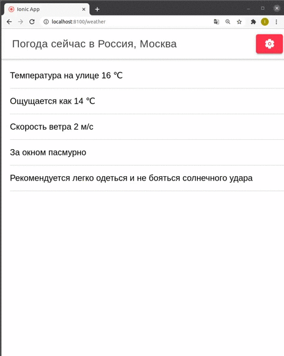

# Сервис прогноза погоды

Сервис призван помогать пользователю быстро определить погоду в своем населенном пункте.

Для реализации данного проекта в виде веб-приложения был использован фреймворк Ionic с использованием Angular. Используемые языки - TypeScript, HTML.

При использовании данного сервиса пользователь попадает на главную страницу с прогнозом погоды города Москва. Если нужно изменить город, то в правом верхнем углу находится кнопка, перенаправляющая на страницу выбора места. После ввода города показывается страница с прогнозом. В прогнозе показывается текущая температура, ощущаемая температура, погодные условия, скорость ветра и рекомендация на день.



## Процесс работы программы

При загрузке приложения происходит получение данных от API Яндекс.Погода для стандартного города (Сейчас это Москва). Если пользователь хочет изменить город, то открывается страница с полем ввода. При выборе города приложение запрашивает координаты выбранного места с помощью Геокодера. Запрос на получение погоды содержит координаты места. После выбора города пользователь возвращается на страницу погоды с обновленной информацией.

## Установка

Необходим установленный Node.js

```sh
npm install 
npm i -g @ionic/cli
```

Перед запуском необходимо в файле /src/environments/api.ts вставить ключи от api сервисов Геокодер и Яндекс.Погода.

## Использование


Для запуска необходимо запустить следующую команду из директории проекта

```sh
ionic serve
```


